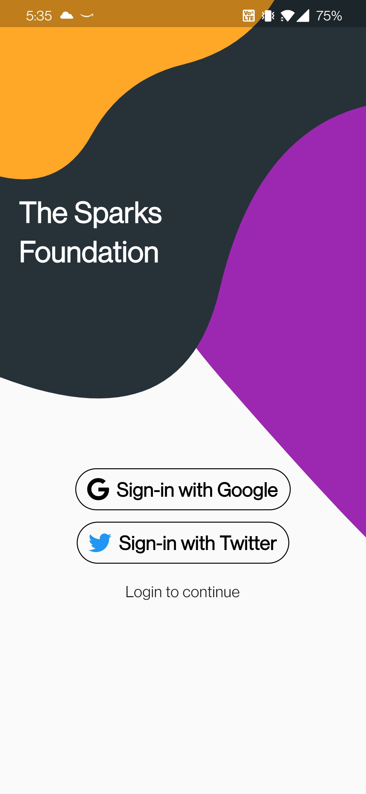

  # Social Media Intergation App (Task #5) , done for The Sparks Foundation as GRIP 
[][youtube]

Learn how to integrate Signin with Google,Twitter and your own app into your Firebase and Flutter app.

### ⚡&ensp;Social Media

&ensp;Twitter: [@aryxnshah](https://twitter.com/aryxnshah)

&ensp;Linkedin: [@aryanshah](https://www.linkedin.com/in/aryanshah1902/)

### ✌&ensp;Preview

|              App Preview             |             Screenshot            |
| :----------------------------------: | :----------------------------------: |
|  | </a> |

### 📺&ensp;Watch Video

##### [YouTube video](https://www.youtube.com/watch?v=ogW83xGQGTg "Youtube Johannes Milke") where the *source code* is explained. [Subscribe YouTube channel.](http://www.youtube.com/channel/UC0FD2apauvegCcsvqIBceLA?sub_confirmation=1 "YouTube Subscribe Johannes Milke")  

[twitter]: https://twitter.com/aryxnshah
[youtube]: https://www.youtube.com/channel/UCsdb_0-4r1XTG-3STi6PBoA
[courses]: https://johannesmilke.teachable.com/p/home
